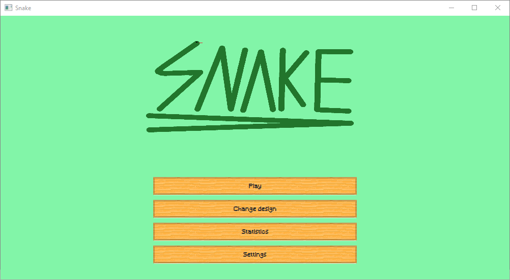
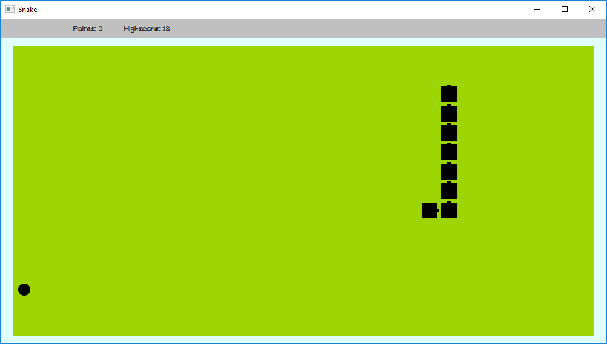
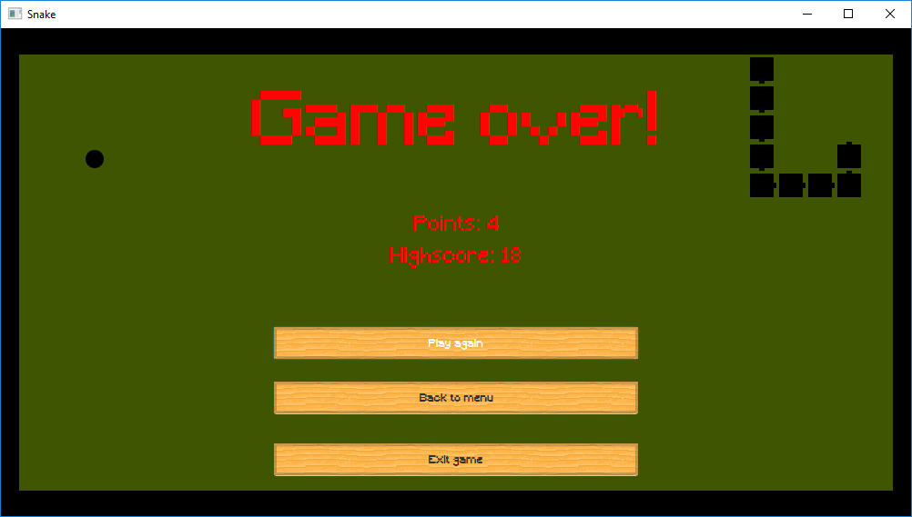

# Snake

The old popular Snake game implemented in JavaFX.

**Note:** This was an school project in 2018 and is no longer maintained.

## Showcase
_Title Screen:_  

_Game:_  

_Death Screen:_  

## Dependencies
| Name               | Description                                             | License                        |
| ------------------ | ------------------------------------------------------- | ------------------------------ |
| [Guava][guava]     | Google core libraries for Java                          | [Apache-2.0][guava-license]    |
| [HikariCP][hikari] | A solid, high-performance, JDBC connection pool at last | [Apache-2.0][hikari-license]   |
| [H2][h2]           | H2 is an embeddable RDBMS written in Java               | [MPL 2.0, EPL 1.0][h2-license] |
| [Log4j][log4j]     | A powerful logging framework                            | [Apache-2.0][log4j-license]    | 

[guava]: https://github.com/google/guava
[guava-license]: https://github.com/google/guava/blob/master/COPYING
[hikari]: https://github.com/brettwooldridge/HikariCP
[hikari-license]: https://github.com/brettwooldridge/HikariCP/blob/dev/LICENSE
[h2]: https://github.com/h2database/h2database
[h2-license]: http://h2database.com/html/license.html
[log4j]: https://github.com/apache/log4j
[log4j-license]: https://github.com/apache/log4j/blob/trunk/LICENSE

## License
This project is licensed under the MIT License. For more information see [LICENSE](https://github.com/neolumia/snake-desktop/blob/master/LICENSE).
